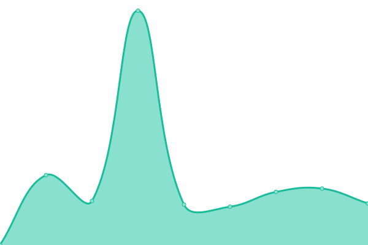

# [📈 Live Status](https://SethuK-ND.github.io/Upptime): <!--live status--> **🟧 Partial outage**

This repository contains the open-source uptime monitor and status page for [SethuK-ND](https://SethuK-ND.github.io/Upptime), powered by [Upptime](https://github.com/upptime/upptime).

With [Upptime](https://upptime.js.org), you can get your own unlimited and free uptime monitor and status page, powered entirely by a GitHub repository. We use [Issues](https://github.com/SethuK-ND/Upptime/issues) as incident reports, [Actions](https://github.com/SethuK-ND/Upptime/actions) as uptime monitors, and [Pages](https://SethuK-ND.github.io/Upptime) for the status page.

<!--start: status pages-->
<!-- This summary is generated by Upptime (https://github.com/upptime/upptime) -->
<!-- Do not edit this manually, your changes will be overwritten -->
<!-- prettier-ignore -->
| URL | Status | History | Response Time | Uptime |
| --- | ------ | ------- | ------------- | ------ |
|  [Tamilmv](https://www.1tamilmv.tf/) | 🟩 Up | [tamilmv.yml](https://github.com/SethuK-ND/Upptime/commits/HEAD/history/tamilmv.yml) | 

 1137ms
     
 | 

<a href="https://SethuK-ND.github.io/Upptime/history/tamilmv">88.42%</a>
    

|  [Tamilblasters](https://1tamilblasters.dad) | 🟩 Up | [tamilblasters.yml](https://github.com/SethuK-ND/Upptime/commits/HEAD/history/tamilblasters.yml) | 

 795ms
     
 | 

<a href="https://SethuK-ND.github.io/Upptime/history/tamilblasters">100.00%</a>
    

|  [BTDigg](https://btdig.com/) | 🟥 Down | [bt-digg.yml](https://github.com/SethuK-ND/Upptime/commits/HEAD/history/bt-digg.yml) | 

 960ms
     
 | 

<a href="https://SethuK-ND.github.io/Upptime/history/bt-digg">0.03%</a>
    

|  [BTDigg[Onion]](http://btdigggink2pdqzqrik3blmqemsbntpzwxottujilcdjfz56jumzfsyd.onion/) | 🟥 Down | [bt-digg-onion.yml](https://github.com/SethuK-ND/Upptime/commits/HEAD/history/bt-digg-onion.yml) | 

 0ms
     
 | 

<a href="https://SethuK-ND.github.io/Upptime/history/bt-digg-onion">0.00%</a>
    

|  [TGX](https://torrentgalaxy.to/) | 🟩 Up | [tgx.yml](https://github.com/SethuK-ND/Upptime/commits/HEAD/history/tgx.yml) | 

 1758ms
     
 | 

<a href="https://SethuK-ND.github.io/Upptime/history/tgx">100.00%</a>
    

<!--end: status pages-->

[**Visit our status website →**](https://SethuK-ND.github.io/Upptime)

## 📄 License

- Powered by: [Upptime](https://github.com/upptime/upptime)
- Code: [MIT](./LICENSE) © [Anand Chowdhary](https://anandchowdhary.com), supported by [Pabio](https://pabio.com)
- Data in the `./history` directory: [Open Database License](https://opendatacommons.org/licenses/odbl/1-0/)
